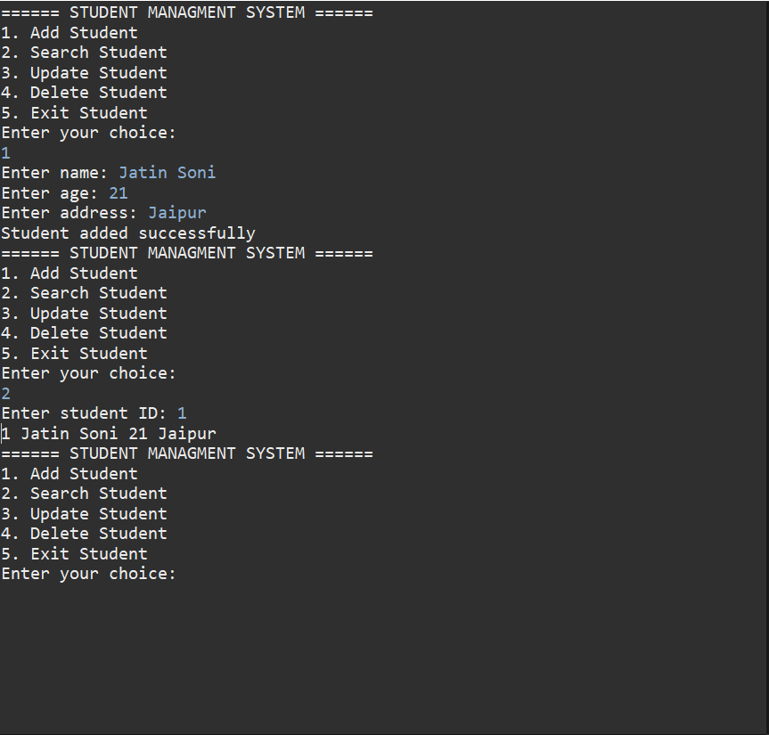

# Student Management System (JDBC)

This project demonstrates a backend application using JDBC with a layered architecture.

It follows a clean structure similar to real-world Java applications.

---

## Architecture

- Controller Layer → Handles user input
- Service Layer → Contains business logic
- DAO Layer → Handles database operations
- Utility Layer → Manages database connection

---

## Features

- Add student
- View student
- Update student
- Delete student
- Uses PreparedStatement for secure queries

---

## Technologies

- Java
- JDBC
- MySQL

---

## Flow

User → Controller → Service → DAO → Database → Response

---

## Screenshot

---

## Learning

- Layered architecture
- JDBC workflow
- Secure database handling
